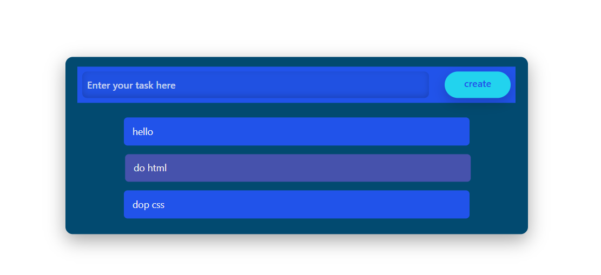
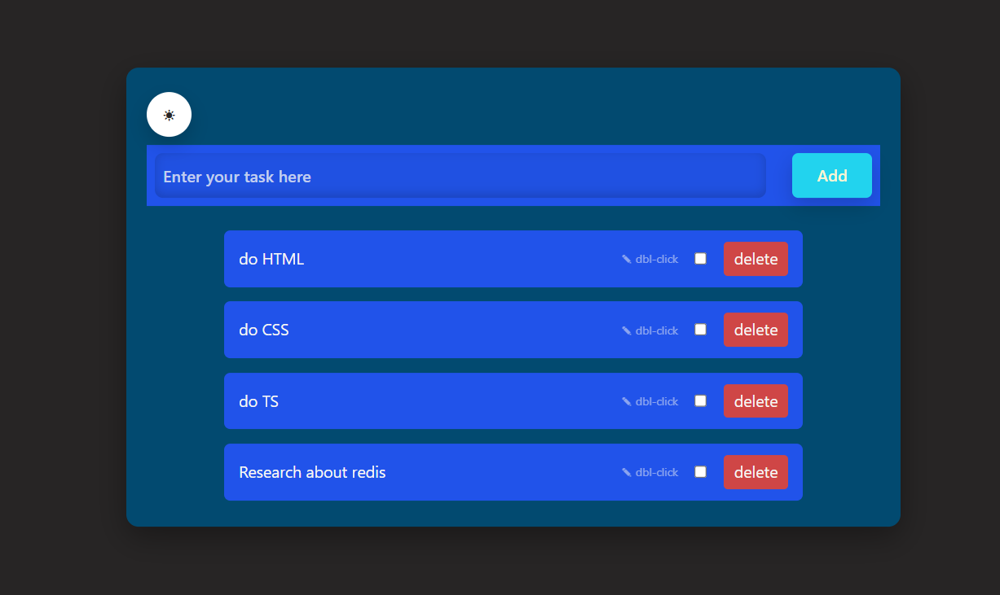

# DOM-1-ToDoApp

A simple To-Do application built using JavaScript DOM manipulation and Tailwind CSS. This project focuses on dynamic element creation, event handling, CSS class manipulation, and event delegation.

## Live Demo

🔗 https://ashu73909.github.io/DOM-1-ToDoApp/

## Features

- Add new tasks dynamically
- Mark tasks as completed/uncompleted by clicking them
- Event delegation using a single event listener
- Input validation for empty tasks
- Dynamic DOM updates without page refresh
- Tailwind CSS based UI styling

## Technologies Used

- HTML5
- CSS3
- JavaScript (ES6)
- Tailwind CSS

## Concepts Practiced

### DOM Manipulation

- `document.getElementById()`
- `document.createElement()`
- `appendChild()`
- `innerText`
- `input.value`

### Event Handling

- `addEventListener()`
- Click event handling
- Event delegation
- `event.target`

### Class Manipulation

- `classList.toggle()`

### UI Development

- Flexbox Layout
- Tailwind Utility Classes
- Hover Effects
- Responsive Width Utilities

## How It Works

1. Enter a task in the input field.
2. Click the **Create** button.
3. A new `<li>` element is created dynamically.
4. The task is appended to the list.
5. Clicking a task toggles its completed state.
6. Clicking the same task again removes the completed state.

## Event Delegation

The application uses event delegation by attaching a single click event listener to the parent `<ul>` element:

```javascript
ulRef.addEventListener('click', function(event) {
    event.target.classList.toggle("completed");
});
```

### Benefits

- Only one event listener is required
- Lower memory usage compared to attaching listeners to every task
- Newly created tasks automatically inherit click behavior
- Cleaner and easier-to-maintain code

## Future Improvements

- Delete button for each task
- Local Storage support
- Edit existing tasks
- Task filtering (All / Active / Completed)
- Clear completed tasks
- Keyboard support (Enter key)
- Responsive design improvements
- Task counter

## Project Structure

```text
DOM-1-ToDoApp/
├── index.html
├── style.css
└── README.md
```

## Screenshot



---
Built while learning JavaScript DOM manipulation and event handling.